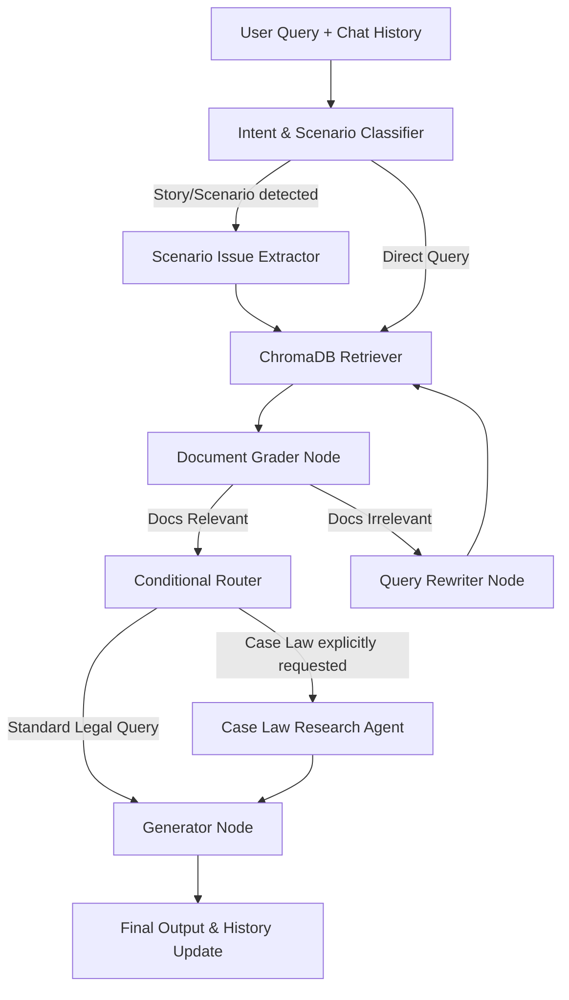

# Project: Legal RAG Bot & Form Generator 

## 1. THE "WHY" ENCODING (INTENT & VALUES)

Core Value: Demo Survival. We have 24 hours. A simple, working MVP is infinitely more valuable than a complex, broken app.

Architecture Intent: Stability > Features. We use a strict Template-Based RAG approach. The AI extracts JSON; the backend injects it into hardcoded HTML/Markdown templates.

Domain Constraint: Absolute strict adherence to provided legal context. Zero legal hallucination is permitted.

## 2. HARD RULES VS. PREFERENCES

$$BINARY BOUNDARIES: YOU MUST DO THIS$$

API Contract: Frontend (React) and Backend (FastAPI) MUST communicate exclusively via REST endpoints.

RAG Outputs: LLM extractions for form generation MUST use response_format={ "type": "json_object" } or LangChain structured output.

Context Isolation: If a legal query cannot be answered by the vector DB context, you MUST output: "I do not have enough information to answer this based on the provided documents."

Strict Typing: Python code MUST use explicit Type Hints (def process(query: str) -> dict:). FastAPI MUST use Pydantic models for request/response validation.

Python Coding Standards (PEP 8 & Pylint):

PEP 8 Compliance: All backend Python code MUST strictly adhere to the PEP 8 style guide.

Pylint Enforcement: Write code that yields a 10/10 Pylint score.

Naming Conventions: You MUST use snake_case for variables/functions, and PascalCase for classes.

Error Handling: You MUST use try-except blocks around all OpenAI API calls and ChromaDB queries. Return proper HTTP 500 status codes from FastAPI if the LLM fails.

$$ GUIDEPOSTS: YOU SHOULD PREFER THIS$$

UI Simplicity: Prefer standard React useState and basic CSS over complex state managers (no Redux) or heavy component libraries.

Speed: Prefer simple, readable loops and standard library functions over clever, heavily abstracted class hierarchies.

Error Handling: Prefer returning clean HTTP 500/400 errors from FastAPI with human-readable messages so the frontend can degrade gracefully.

## 3. ANTI-PATTERNS (THE "NEVER" LIST)

NEVER hallucinate Python libraries or Node packages. If it is not in requirements.txt or package.json, ask before using pip install or npm install.

NEVER write legal contracts from scratch via LLM text generation. (This breaks formatting and introduces risk).

NEVER rewrite working legacy code or refactor whole files unless explicitly instructed to do so. ONLY modify the lines necessary for the requested feature.

NEVER hardcode API keys (OPENAI_API_KEY). Always use os.environ.get() or a .env file.

NEVER leave raw // TODO: or # TODO: comments in generated code. Implement the fix or ask the user for clarification.

NEVER break the API schema. If you change a Pydantic model in FastAPI, you MUST update the corresponding TypeScript interface in React.

NEVER bypass Pylint rules. Avoid writing code that requires disabling Pylint warnings via # pylint: disable= unless absolutely unavoidable (e.g., framework-specific quirks).

## 4. PROGRESSIVE DISCLOSURE & POINTERS

This file contains top-level architectural rules. For specific subsystem contexts, check the following locations before modifying code:

Frontend specific rules: Check frontend/README.md (if it exists).

Backend specific rules: Check backend/README.md (if it exists).

Template Schema: Always read the placeholder variables in templates/*.html before modifying the JSON extraction prompt in llm_service.py.

## 5. INTENT-BASED VERIFICATION ROUTINE

Before presenting final code or confirming a task is complete, you MUST execute this self-correction loop:

Linting Check: Does the Python code pass PEP 8? (Mentally verify against Pylint standards or run pylint target_file.py). Ensure 10/10 score.

Type Check: Do the FastAPI endpoint Pydantic schemas perfectly match the React frontend fetch payloads?

CORS Check: If adding a new API endpoint, is it covered by the CORS middleware in main.py?

State Check: If modifying React state, verify it does not cause an infinite render loop in a useEffect.

## 6. TECH STACK & COMMANDS

Frontend: React, TypeScript, HTML/CSS (Vite) -> cd app && npm run dev

Backend: FastAPI (Python 3.11+) -> cd server && uvicorn main:app --reload

AI/DB Stack: Nvidia Nim API (OpenAI-compatible), LangChain, LangGraph, ChromaDB

PDF Gen: reportlab or pdfkit

Linting: Pylint -> cd server && pylint main.py llm_service.py rag_engine.py

## 7. DIRECTORY STRUCTURE

/
├── app/                        # React Frontend (Vite)
│   ├── src/
│   │   ├── api.ts              # Fetch wrappers for FastAPI endpoints
│   │   ├── components/         # ChatUI, HistorySidebar, ScenarioInput
│   │   └── App.tsx             # Main Layout
├── server/                     # FastAPI Backend
│   ├── main.py                 # FastAPI application & REST endpoints
│   ├── rag_engine.py           # ChromaDB retriever & vector search logic
│   ├── llm_service.py          # OpenAI-compatible API wrappers
│   └── agent/
│       ├── state.py            # LangGraph TypedDict definitions (State schema)
│       ├── llm.py              # Embedding & Chat Model initialization
│       ├── history.py          # Chat history session manager & summarization logic
│       ├── graph.py            # LangGraph orchestration (compiling the nodes)
│       └── node/               # Individual LangGraph nodes
│           ├── classifier.py   # Intent & Scenario routing
│           ├── retriever.py    # Fetches from vector DB
│           ├── grader.py       # Evaluates document relevance
│           ├── rewriter.py     # Rewrites query if docs are irrelevant
│           ├── researcher.py   # Conditional Case Law fetcher
│           └── generator.py    # Final legal synthesis & formatting
├── data/                       # Raw PDFs & Vector Store storage
└── vector_store/               # Locally persisted ChromaDB files

## 8. IMPLEMENTATION PLAN: ADVANCED RAG & AGENTS

### User / Logic Architecture
This flow defines how a user's request is orchestrated via LangGraph:

### Component Details
1. **Chat History Strategy (`server/agent/history.py`)**
   - **Session Management:** `session_id` allows switching histories.
   - **Sliding Context Window:** Maintain last 3-4 raw conversational turns.
   - **Dynamic Summarization:** Background LLM summarizes older messages into `memory_summary` to preserve context without exceeding token limits.

2. **State Definition (`server/agent/state.py`)**
   - Includes `session_id`, `chat_history`, `memory_summary`, `query`, `is_scenario`, `requires_case_law`, `documents`, `case_laws`.

3. **Scenario-Based Legal Advice**
   - **Scenario Analyzer (Pre-Retrieval):** Extracts core legal concepts (e.g., "coercion") from a hypothetical story before querying ChromaDB.
   - **Scenario Synthesizer (Post-Retrieval):** Maps retrieved legal principles to the specific hypothetical facts.

4. **Self-Corrective RAG (`server/agent/node/`)**
   - **Document Grader:** LLM evaluates if retrieved docs address the query.
   - **Query Rewriter:** Rewrites query for better vector matching if docs are irrelevant.
   - **Generator:** Strict adherence to context. Outputs fallback if insufficient info.

5. **Conditional Case Law Research Agent (`server/agent/node/researcher.py`)**
   - Triggered conditionally via `Intent Classifier` if case law is explicitly requested.
   - Pulls historical context and presents case name, ruling, alongside statutory response.

### API Communication (REST)
- **`POST /api/chat`**
  - Req: `{ "session_id": "123", "message": "My query" }`
  - Res: `{ "reply": "...", "case_laws": [...], "status": "success" }`
- **`GET /api/history/{session_id}`**
- **`GET /api/sessions`**
