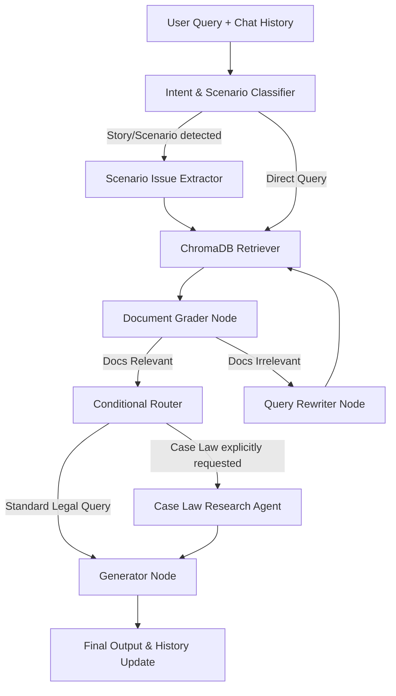

<div align="center">
  
  <h1>⚖️ Ma'at - Legal RAG AI Assistant</h1>
  <p><em>An advanced Multi-Agent Legal Copilot utilizing Self-Reflective RAG and NVIDIA Nemotron Embeddings</em></p>

  <a href="#tech-stack">Tech Stack</a> •
  <a href="#architecture">Architecture</a> •
  <a href="#getting-started">Getting Started</a> •
  <a href="#future-improvements">Roadmap</a> •
  <a href="#contributing">Contributing</a>
</div>

---

##  About The Project

**Ma'at** is a sophisticated legal advisory AI assistant designed to provide accurate, context-aware, and strictly factual legal guidance. Built on a strict Template-Based RAG approach, it extracts legal intelligence from vast vector stores of statutory data and historical case law to deliver highly precise responses without hallucination.

The system utilizes an advanced **Multi-Agent Orchestration workflow (LangGraph)** that features self-reflective retrieval, document grading, and query rewriting to ensure that the user receives the highest quality legal counsel based strictly on the provided documents.

---

##  Tech Stack

<div align="center">
  
  
  
  
  
  
</div>

<br/>

* **AI/LLM Core:** LangChain, LangGraph, NVIDIA Nim API
* **Vector Database:** ChromaDB
* **Data Processing Pipeline:** Docling, Unstructured

---

##  System Architecture

Ma'at is built on a highly modular Multi-Agent workflow. When a user submits a query, it is analyzed for intent (e.g., standard question vs. hypothetical scenario), retrieved via a vector search, and then vigorously evaluated by a **Grader Node**. If the retrieved documents are deemed irrelevant, the **Rewriter Node** restructures the query and attempts retrieval again.



---

##  Getting Started (Docker Deployment)

The easiest way to run the entire Ma'at stack (Frontend + FastAPI + AI Agents) is via the unified single-container Docker build. 

### Prerequisites
* Docker installed and running
* An `.env` file in the root directory containing your API keys (e.g., `NVIDIA_API_KEY`, etc.)

### 1. Build the Application
Ensure you include the period `.` at the end of the command!
```bash
sudo docker build -t maat-ai .
```

### 2. Run the Application
We mount the `data` and `vector_store` directories as live volumes so that your AI's brain and chat history are safely persisted on your local machine, not trapped inside the container!
```bash
sudo docker run -d -p 8000:8000 \
  -v $(pwd)/data:/app/data \
  -v $(pwd)/vector_store:/app/vector_store \
  --env-file .env \
  maat-ai
```

### 3. Open the App
Navigate to **`http://localhost:8000`** in your browser. The single container serves the beautiful React UI and handles the backend API routing seamlessly!

---

##  Roadmap & Future Improvements

We are constantly iterating to make Ma'at more powerful and robust. Current efforts include:

* **Hybrid Search Implementation:** Upgrading the retrieval pipeline to use a combination of BM25 (keyword matching) and NVIDIA Nemotron dense vector embeddings to solve metadata-filtering blind spots.
* **Tool Calling Agent Middleware:** Decoupling tool execution logic from primary agents to allow for real-time external API requests (e.g., live legal database scraping).
* **Automated Legal Form Generation:** Integrating the LLM outputs dynamically into hardcoded HTML/Markdown templates to spit out production-ready legal forms.
* **Expanded Case Law Analysis:** Deepening the Case Law Agent's capability to cross-reference conflicting judicial precedents.

---

##  How to Contribute

Contributions are what make the open-source community such an amazing place to learn, inspire, and create. Any contributions you make are **greatly appreciated**.

1. **Fork the Project**
2. **Create your Feature Branch:** `git checkout -b feature/AmazingFeature`
3. **Commit your Changes:** `git commit -m 'Add some AmazingFeature'` (Make sure you pass all PEP 8 Linting checks!)
4. **Push to the Branch:** `git push origin feature/AmazingFeature`
5. **Open a Pull Request**

### Code Standards
* **Python Code:** Must strictly adhere to **PEP 8** style guidelines and aim for a 10/10 Pylint score.
* **No Hallucinations:** RAG outputs must be configured with strictly typed JSON schemas (Pydantic). 
* **Type Hinting:** Mandatory for all backend Python functions.

<div align="center">
  <p>Built with ❤️ for the Legal Tech Community.</p>
</div>
